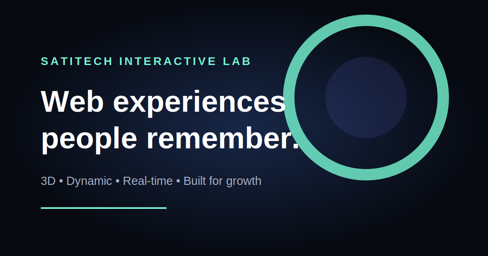

# SatiTech Interactive Showcase

[](https://github.com/satitech-official/satitech-showcase/actions/workflows/ci.yml)
[](https://github.com/satitech-official/satitech-showcase/actions/workflows/deploy-pages.yml)

An original, browser-native showcase of the complete real-world websites and interactive experiences **SatiTech** can design and develop for modern businesses.

**[Explore the live showcase →](https://satitech-official.github.io/satitech-showcase/)**



## Complete real-world sample websites

Eight full-page responsive concepts use real licensed photography, selected commercial-use video and working customer journeys:

| Concept | Industry | Working interactions |
| --- | --- | --- |
| Ember & Oak | Restaurant | Menu filters, table request, WhatsApp, gallery and video controls |
| Iron Pulse | Gym | Program filters, trial booking, schedules and video controls |
| Northstar Academy | Education | Admissions, academics, campus content and enquiry flow |
| Terra Trails | Travel | Package filters, trip planner, gallery and destination video |
| Verdant Estates | Real estate | Unit filters, site-visit request, maps and gallery |
| Aurelia House | Jewellery | Collection filters, image lightbox and consultation request |
| Nivara Clinic | Healthcare | Service filters, appointment request, call and directions |
| NextPlay Academy | Sports | Player pathways, registration, fixtures-ready content and trials |

Every concept includes working navigation, live interface states, filters, media galleries, call/email/map actions and a form that opens a pre-filled SatiTech WhatsApp enquiry. All showcased brand identities are fictional and original.

## Interactive 3D experiences

| Experience | Industry | Demonstrated capabilities |
| --- | --- | --- |
| 3D Product Studio | E-commerce | Product customisation, real-time materials, conversion UI |
| Virtual Property Tour | Real estate | Interactive architecture, environment modes, lead journeys |
| Immersive Dining | Hospitality | Menu storytelling, booking flows, cinematic presentation |
| Live Intelligence | SaaS | Streaming metrics, operational dashboards, data visualisation |
| Digital Stage | Events | Event launches, registrations, schedules and media experiences |
| Future Brand World | Brands | Art direction, motion systems and immersive brand storytelling |
| Connected Campus | Education | Admissions, notices, results and bilingual campus journeys |
| Performance Arena | Fitness | Programs, trainers, memberships and trial bookings |
| Digital Care Desk | Healthcare | Doctors, services, appointments and patient guidance |
| Journey Explorer | Travel | Packages, trip planning, maps and booking journeys |
| Luxury Collection Room | Jewellery & fashion | Collections, lookbooks and premium product discovery |
| Live Sports Hub | Sports | Registrations, fixtures, live results and academy content |

Each of the twelve demos opens as an interactive studio. Visitors can orbit the 3D scene, change its colour, adjust its visual energy and switch presentation modes. The live values are transparent UI simulations; production client work connects to secure APIs, databases and content systems.

## Technology

- React 19 and Vite
- Three.js with React Three Fiber and Drei
- Framer Motion
- Responsive, accessible CSS
- ESLint quality checks
- GitHub Actions CI and Pages deployment

The 3D capability lab uses no third-party photographs or commercial 3D models. Its visual scenes are procedurally assembled from original geometry in the browser.

The real-world concept sites use photography served by Unsplash under the Unsplash License and selected video served by Coverr with commercial-use rights. Production client projects should replace this demonstration media with client-approved assets.

## Local development

```bash
npm install
npm run dev
```

Quality and production checks:

```bash
npm run lint
npm run build
npm run preview
```

Node.js 22 or newer is recommended.

## Project structure

```text
src/
├── components/
│   ├── DemoModal.jsx       # Interactive control studio and live UI
│   ├── RealWorldShowcase.jsx # Eight complete real-world website concepts
│   └── SceneCanvas.jsx     # Twelve procedural Three.js experiences
├── App.jsx                 # Showcase page and conversion journeys
├── data.js                 # Industry experience content
├── realWorldData.js        # Real-world website content and licensed media URLs
├── real-world.css          # Responsive website-concept visual system
└── styles.css              # Responsive visual system
```

## Accessibility and performance

- Keyboard-visible focus states and semantic controls
- Escape-key support for closing interactive previews
- Reduced-motion CSS support
- Mobile layouts and controlled WebGL pixel density
- Vendor chunk splitting and production minification

## Work with SatiTech

Need a website, commerce experience, dashboard or immersive product?

- Website: [satitechnologies.com](https://www.satitechnologies.com/)
- WhatsApp: [+91 91310 43573](https://wa.me/919131043573)
- Email: [satitechinfo@gmail.com](mailto:satitechinfo@gmail.com)
- Instagram: [@satitech.official](https://www.instagram.com/satitech.official)

Built by **Sati Technologies**, Indore, India.

## License

Released under the [MIT License](LICENSE). Brand names and SatiTech identity assets remain the property of Sati Technologies.
